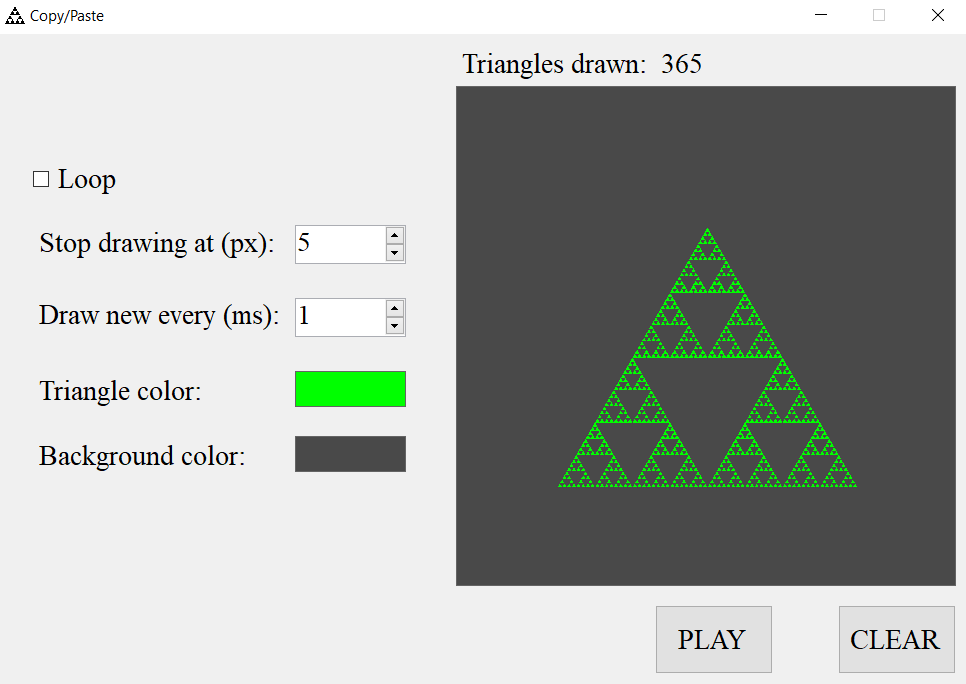

# Sierpinski's Triangle

This C# Windows Form Application has been created as homework assignment as part of selection proccess for Fon Hackathon 2022 in a team Copy/Paste.
Application draw's a Sierpinski's triangle by drawing miniatures triangles recursivly. App allows to change the color of the triangle, background, how fast to draw and how small. It also allows for looping animation.

## Preview

